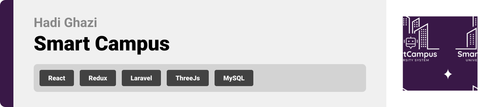
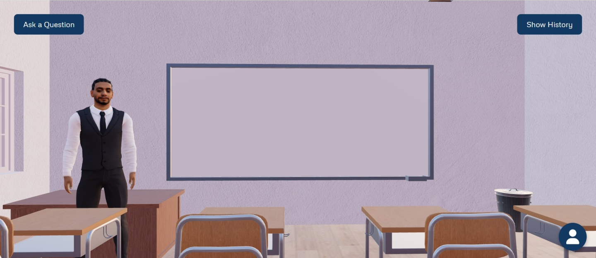

<br><br>

<!-- project philosophy -->


>SmartCampus is a robust, all-in-one university system designed to revolutionize student administration and enhance the learning experience. With a comprehensive suite of features, it seamlessly handles everything from student information and payments to course management, grading, and learning resources. The platform’s cutting-edge AI capabilities offer personalized experiences, such as tailored major and course recommendations, interactive 3D AI instructor, and intelligent content generation. SmartCampus fosters engagement through integrated communication tools, including dedicated course channels and live chats, providing a dynamic and efficient environment for students, instructors, and administrators alike.

## User Stories

### Student
1. *As a student, I want to access my course schedule, materials, assignments, grades, exams, academic history, and fees in one place so that I can stay organized and efficiently manage my academic responsibilities.*

2. *As a student, I want to interact with a 3D AI instructor for personalized study assistance and receive AI-driven recommendations for courses and AI-generated practice questions to optimize my learning experience.*

3. *As a student, I want to engage with instructors and peers through dedicated course channels for discussions, updates, and collaboration, ensuring effective communication and support throughout the semester.*

### Instructor
1. *As an instructor, I want to create, manage, and grade course content, and assignments, and allow students to submit their work through the system so that I can effectively evaluate performance and streamline the grading process.*

2. *As an instructor, I want to access my assigned courses and view my teaching history, including past courses, so that I can manage my academic responsibilities.*

3. *As an instructor, I want to communicate with students through dedicated course channels for discussions, updates, and answering questions, ensuring clear communication and ongoing support throughout the course.*

### Admin
1. *As an admin, I want to manage student and instructor accounts, including handling course registrations, so that I can ensure accurate and up-to-date information in the system.*

2. *As an admin, I want to process payments and manage student financial records, as well as oversee instructor payroll, to ensure smooth financial operations.*

3. *As an admin, I want to manage university logistics such as transportation, dormitories, exams, and library access to ensure that all student services operate efficiently.*

### Super Admin
1. *As a super admin, I want to manage higher-level tasks such as overseeing faculties, campuses, majors, and courses so that I can maintain and optimize the university’s structure and academic offerings.*

2. *As a super admin, I want to manage admin accounts and salaries, set global payment policies, and oversee instructor payroll to ensure efficient system-wide operations.*

3. *As a super admin, I want to manage and publish important announcements and news across the platform so that I can keep all users informed of critical updates and events.* 

### Prospective Student
1. *As a prospective student, I want to explore detailed information about courses and programs offered by the university so that I can make an informed decision about my educational path.*

2. *As a prospective student, I want to apply for admission, submit necessary information online, and receive support through chat with student affairs so that I can manage the application process and get answers to any questions.*

3. *As a prospective student, I want to use AI-driven recommendations to choose a major that aligns with my preferences and career goals so that I can select a field of study that best fits my interests.*

   
<br><br>
<!-- Tech stack -->


### SmartCampus is built using the following technologies:

- **[React](https://reactjs.org/)**: The front-end library used for building dynamic and responsive user interfaces.
- **[TypeScript](https://www.typescriptlang.org/)**: Enhances the development process with type safety and improved code quality in the React application.
- **[RTK Query](https://redux-toolkit.js.org/rtk-query/overview)**: Facilitates data fetching, caching, and global state management in the application.
- **[Laravel](https://laravel.com/docs)**: The back-end framework handling server-side logic, database interactions, and API management.
- **[MySQL](https://dev.mysql.com/doc/)**: The relational database management system used for storing and managing application data.
- **[OpenAI](https://platform.openai.com/docs)**: Provides AI-driven functionalities for personalized recommendations and intelligent content generation.
- **[Three.js](https://threejs.org/docs/index.html#manual/en/introduction/Creating-a-scene) & [React Three Fiber](https://docs.pmnd.rs/react-three-fiber/getting-started)**: Employed for creating and rendering immersive 3D features within the application.
- **[Firebase](https://firebase.google.com/docs)**: Used for real-time chat and communication features, including dedicated course channels.

<br><br>
<!-- UI UX -->


> We designed SmartCampus using wireframes and mockups, iterating on the design until we reached the ideal layout for easy navigation and a seamless user experience.

- Project Figma design [figma](https://www.figma.com/design/jsEC9MgbFvVbYnWYII3Gyu/SmartCampus?node-id=0-1&node-type=canvas&t=iTyTBVRnBjC7e2m9-0)


### Mockups
| Landing Page  | 3D AI Instructor Page |
| ---| ---|
| |  |

<br><br>

<!-- Database Design -->


###  Architecting Data Excellence: Innovative Database Design Strategies:

- Insert ER Diagram here


<br><br>


<!-- Implementation -->


### User Screens (Mobile)
| Login screen  | Register screen | Landing screen | Loading screen |
| ---| ---| ---| ---|
|  |  |  |  |
| Home screen  | Menu Screen | Order Screen | Checkout Screen |
|  |  |  |  |

### Admin Screens (Web)
| Login screen  | Register screen |  Landing screen |
| ---| ---| ---|
|  |  |  |
| Home screen  | Menu Screen | Order Screen |
|  |  |  |

<br><br>


<!-- Prompt Engineering -->


### Mastering AI Interaction: Unveiling the Power of Prompt Engineering

- This project leverages advanced AI capabilities through the OpenAI API to enhance user interactions and experiences. By integrating AI-driven features, we provide personalized course and major recommendations, generate practice questions from course materials, and offer support through an interactive 3D AI instructor. These innovations ensure a tailored and engaging educational experience, optimizing learning and decision-making processes.

<br><br>

<!-- AWS Deployment -->


###  Efficient AI Deployment: Unleashing the Potential with AWS Integration:

- This project leverages AWS deployment strategies to seamlessly integrate and deploy natural language processing models. With a focus on scalability, reliability, and performance, we ensure that AI applications powered by these models deliver robust and responsive solutions for diverse use cases.

<br><br>

<!-- Unit Testing -->


###  Precision in Development: Harnessing the Power of Unit Testing:

- This project employs rigorous unit testing methodologies to ensure the reliability and accuracy of code components. By systematically evaluating individual units of the software, we guarantee a robust foundation, identifying and addressing potential issues early in the development process.

<br><br>


<!-- How to run -->


> To set up Coffee Express locally, follow these steps:

### Prerequisites

This is an example of how to list things you need to use the software and how to install them.
* npm
  ```sh
  npm install npm@latest -g
  ```

### Installation

_Below is an example of how you can instruct your audience on installing and setting up your app. This template doesn't rely on any external dependencies or services._

1. Get a free API Key at [example](https://example.com)
2. Clone the repo
   git clone [github](https://github.com/your_username_/Project-Name.git)
3. Install NPM packages
   ```sh
   npm install
   ```
4. Enter your API in `config.js`
   ```js
   const API_KEY = 'ENTER YOUR API';
   ```

Now, you should be able to run Coffee Express locally and explore its features.
