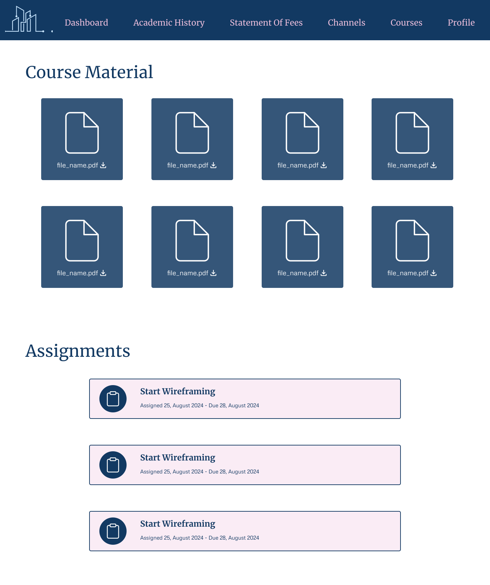
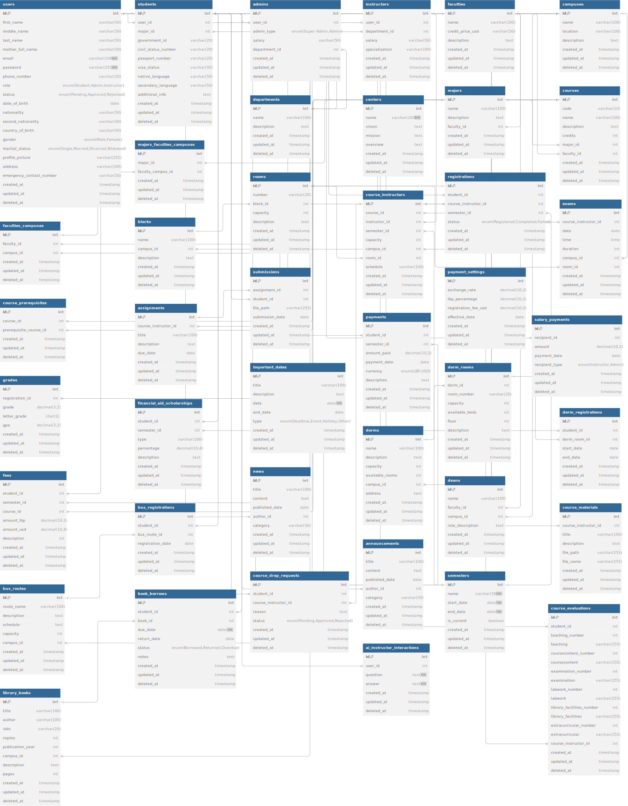

<br><br>

<!-- project philosophy -->


>SmartCampus is a robust, all-in-one university system designed to revolutionize student administration and enhance the learning experience. With a comprehensive suite of features, it seamlessly handles everything from student information and payments to course management, grading, and learning resources. The platform’s cutting-edge AI capabilities offer personalized experiences, such as tailored major and course recommendations, an interactive 3D AI instructor, and intelligent content generation. SmartCampus also integrates machine learning to assess course success based on student evaluations, providing visual insights through detailed graphs, and utilizes AI to deliver comprehensive analysis of these results. The platform fosters engagement through integrated communication tools, including dedicated course channels and live chats, creating a dynamic and efficient environment for students, instructors, and administrators alike.

## User Stories

### Student
1. *As a student, I want to access my course schedule, materials, assignments, grades, exams, academic history, and fees in one place so that I can stay organized and efficiently manage my academic responsibilities.*

2. *As a student, I want to interact with a 3D AI instructor for personalized study assistance and receive AI-driven recommendations for courses and AI-generated practice questions to optimize my learning experience.*

3. *As a student, I want to engage with instructors and peers through dedicated course channels for discussions, updates, and collaboration, ensuring effective communication and support throughout the semester.*

### Instructor
1. *As an instructor, I want to create, manage, and grade course content, and assignments, and allow students to submit their work through the system so that I can effectively evaluate performance and streamline the grading process.*

2. *As an instructor, I want to access my assigned courses and view my teaching history, including past courses, so that I can manage my academic responsibilities.*

3. *As an instructor, I want to communicate with students through dedicated course channels for discussions, updates, and answering questions, ensuring clear communication and ongoing support throughout the course.*

### Admin
1. *As an admin, I want to manage student and instructor accounts, including handling course registrations, so that I can ensure accurate and up-to-date information in the system.*

2. *As an admin, I want to process payments and manage student financial records, as well as oversee instructor payroll, to ensure smooth financial operations.*

3. *As an admin, I want to manage university logistics such as transportation, dormitories, exams, and library access to ensure that all student services operate efficiently.*

### Super Admin
1. *As a super admin, I want to manage higher-level tasks such as overseeing faculties, campuses, majors, and courses, as well as managing admin accounts, salaries, and global payment policies, so that I can maintain and optimize the university’s structure and ensure efficient operations.*

2. *As a super admin, I want to oversee instructor payroll and publish important news and announcements across the platform and via email, targeted by the recipient's role, to keep all users informed of critical updates and ensure smooth payroll management.*

3. *As a super admin, I want to generate detailed reports using machine learning and AI for comprehensive analysis of course evaluations, and be able to download these reports as PDFs to provide insights on course success and other performance metrics. [Example PDF](./readme/assets/CS107_Database%20Systems_JohnA.Doe.pdf)*

### Prospective Student
1. *As a prospective student, I want to explore detailed information about courses and programs offered by the university so that I can make an informed decision about my educational path.*

2. *As a prospective student, I want to apply for admission, submit necessary information online, and receive support through chat with student affairs so that I can manage the application process and get answers to any questions.*

3. *As a prospective student, I want to use AI-driven recommendations to choose a major that aligns with my preferences and career goals so that I can select a field of study that best fits my interests.*

   
<br><br>
<!-- Tech stack -->


### SmartCampus is built using the following technologies:

- **[React](https://reactjs.org/)**: The front-end library used for building dynamic and responsive user interfaces.
- **[TypeScript](https://www.typescriptlang.org/)**: Enhances the development process with type safety and improved code quality in the React application.
- **[RTK Query](https://redux-toolkit.js.org/rtk-query/overview)**: Facilitates data fetching, caching, and global state management in the application.
- **[Zustand](https://github.com/pmndrs/zustand)**: Utilized for global state management in the chat application, providing a streamlined state management solution.
- **[Laravel](https://laravel.com/docs)**: The back-end framework handling server-side logic, database interactions, and API management.
- **[MySQL](https://dev.mysql.com/doc/)**: The relational database management system used for storing and managing application data.
- **[OpenAI](https://platform.openai.com/docs)**: Provides AI-driven functionalities for personalized recommendations and intelligent content generation.
- **[Three.js](https://threejs.org/docs/index.html#manual/en/introduction/Creating-a-scene) & [React Three Fiber](https://docs.pmnd.rs/react-three-fiber/getting-started)**: Employed for creating and rendering immersive 3D features within the application.
- **[Firebase](https://firebase.google.com/docs)**: Used for real-time chat and communication features, including dedicated course channels.
- **[FastAPI](https://fastapi.tiangolo.com/)**: A modern web framework used with Python to create endpoints for interacting with the machine learning model.
- **[scikit-learn](https://scikit-learn.org/stable/)**: Utilized for machine learning tasks, including model training and predictions.
- **[Matplotlib](https://matplotlib.org/)**: Employed for data visualization, providing graphical representations of analysis results.

<br><br>
<!-- UI UX -->


> We designed SmartCampus using wireframes and mockups, iterating on the design until we reached the ideal layout for easy navigation and a seamless user experience.

- Project Figma design [figma](https://www.figma.com/design/jsEC9MgbFvVbYnWYII3Gyu/SmartCampus?node-id=0-1&node-type=canvas&t=iTyTBVRnBjC7e2m9-0)


### Mockups
<table>
  <tr>
    <th style="width: 50%; text-align: center;">Public Landing Page</th>
    <th style="width: 50%; text-align: center;">Student Dashboard / Course Details</th>
  </tr>
  <tr>
    <td style="text-align: center;">
      
    </td>
    <td style="text-align: center;">
      
       <br /> <br /> <br />
       
    </td>
  </tr>
</table>

<br><br>

<!-- Database Design -->


###  Architecting Data Excellence: Innovative Database Design Strategies:


>The database is avilable in /readme/assets as png, pdf, svg, and MySQL code for more details.

<br><br>


<!-- Implementation -->


### Student Screens
| 3D AI Instructor Screen  | Course Evaluation Report |  Landing screen |
| ---| ---| ---|
|  |  |  |
| Home screen  | Menu Screen | Order Screen |
|  |  |  |

<br><br>


<!-- Prompt Engineering -->


### Mastering AI Interaction: Unveiling the Power of Prompt Engineering

- This project leverages advanced AI capabilities through the OpenAI API and machine learning technologies to enhance user interactions and experiences. We integrate AI-driven features to provide personalized course and major recommendations, generate practice questions from course materials, and offer support through an interactive 3D AI instructor. Additionally, machine learning is employed to assess course success based on evaluations, visualize data with graphs, and provide comprehensive analysis through detailed reports. These innovations ensure a tailored and engaging educational experience, optimizing learning, decision-making processes, and performance insights.

<br><br>

<!-- AWS Deployment -->


###  Efficient AI Deployment: Unleashing the Potential with AWS Integration:

- This project leverages AWS deployment strategies to seamlessly integrate and deploy natural language processing models. With a focus on scalability, reliability, and performance, we ensure that AI applications powered by these models deliver robust and responsive solutions for diverse use cases.

<br><br>

<!-- Unit Testing -->


###  Precision in Development: Harnessing the Power of Unit Testing:

- This project employs rigorous unit testing methodologies to ensure the reliability and accuracy of code components. By systematically evaluating individual units of the software, we guarantee a robust foundation, identifying and addressing potential issues early in the development process.

<br><br>


<!-- How to run -->


> To set up Coffee Express locally, follow these steps:

### Prerequisites

This is an example of how to list things you need to use the software and how to install them.
* npm
  ```sh
  npm install npm@latest -g
  ```

### Installation

_Below is an example of how you can instruct your audience on installing and setting up your app. This template doesn't rely on any external dependencies or services._

1. Get a free API Key at [example](https://example.com)
2. Clone the repo
   git clone [github](https://github.com/your_username_/Project-Name.git)
3. Install NPM packages
   ```sh
   npm install
   ```
4. Enter your API in `config.js`
   ```js
   const API_KEY = 'ENTER YOUR API';
   ```

Now, you should be able to run Coffee Express locally and explore its features.
