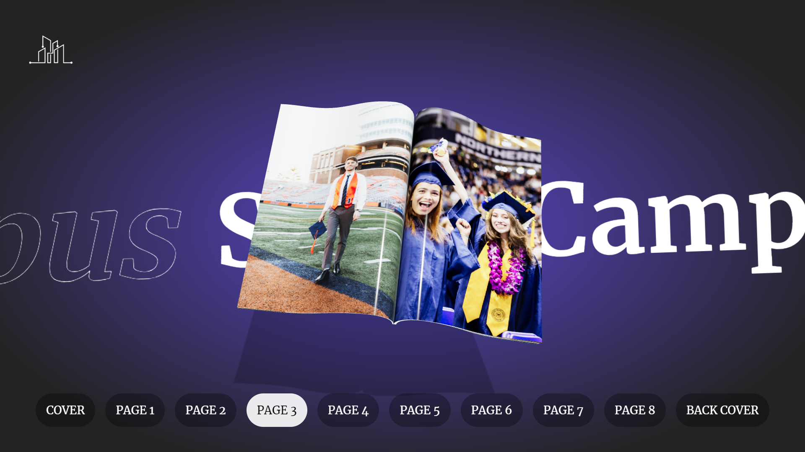

<br><br>

<!-- project philosophy -->


>SmartCampus is a robust, all-in-one university system designed to revolutionize student administration and enhance the learning experience. With a comprehensive suite of features, it seamlessly handles everything from student information and payments to course management, grading, and learning resources. The platform’s cutting-edge AI capabilities offer personalized experiences, such as tailored major and course recommendations, an interactive 3D AI instructor, and intelligent content generation. SmartCampus also integrates machine learning to assess course success based on student evaluations, providing visual insights through detailed graphs, and utilizes AI to deliver comprehensive analysis of these results. The platform fosters engagement through integrated communication tools, including dedicated course channels and live chats, creating a dynamic and efficient environment for students, instructors, and administrators alike.

## User Stories

### Student
1. As a student, I want to access my course schedule, materials, assignments, grades, exams, academic history, and fees in one place so that I can stay organized and efficiently manage my academic responsibilities.

2. As a student, I want to interact with a 3D AI instructor for personalized study assistance and receive AI-driven recommendations for courses and AI-generated practice questions to optimize my learning experience.

3. As a student, I want to engage with instructors and peers through dedicated course channels for discussions, updates, and collaboration, ensuring effective communication and support throughout the semester.

### Instructor
1. As an instructor, I want to create, manage, and grade course content, and assignments, and allow students to submit their work through the system so that I can effectively evaluate performance and streamline the grading process.

2. As an instructor, I want to access my assigned courses and view my teaching history, including past courses, so that I can manage my academic responsibilities.

3. As an instructor, I want to communicate with students through dedicated course channels for discussions, updates, and answering questions, ensuring clear communication and ongoing support throughout the course.

### Admin
1. As an admin, I want to manage student and instructor accounts, including handling students and careers applications, so that I can ensure accurate and up-to-date information in the system.

2. As an admin, I want to process payments and manage student financial records, as well as oversee instructor payroll, to ensure smooth financial operations.

3. As an admin, I want to manage university logistics such as transportation, dormitories, exams, and library access to ensure that all student services operate efficiently.

### Super Admin
1. As a super admin, I want to manage higher-level tasks such as overseeing faculties, campuses, majors, and courses, as well as managing admin accounts, salaries, and global payment policies, so that I can maintain and optimize the university’s structure and ensure efficient operations.

2. As a super admin, I want to oversee instructor payroll and publish important news and announcements across the platform and via email, targeted by the recipient's role, to keep all users informed of critical updates and ensure smooth payroll management.

3. As a super admin, I want to generate detailed reports using machine learning and AI for comprehensive analysis of course evaluations, and be able to download these reports as PDFs to provide insights on course success and other performance metrics. [Example PDF](./readme/assets/CS107_Database%20Systems_JohnA.Doe.pdf)

### Prospective Student
1. As a prospective student, I want to explore detailed information about courses and programs offered by the university so that I can make an informed decision about my educational path.

2. As a prospective student, I want to apply for admission, submit necessary information online, and receive support through chat with student affairs so that I can manage the application process and get answers to any questions.

3. As a prospective student, I want to use AI-driven recommendations to choose a major that aligns with my preferences and career goals so that I can select a field of study that best fits my interests.

   
<br><br>
<!-- Tech stack -->


### SmartCampus is built using the following technologies:

- **[React](https://reactjs.org/)**: The front-end library used for building dynamic and responsive user interfaces.
- **[TypeScript](https://www.typescriptlang.org/)**: Enhances the development process with type safety and improved code quality in the React application.
- **[RTK Query](https://redux-toolkit.js.org/rtk-query/overview)**: Facilitates data fetching, caching, and global state management in the application.
- **[Zustand](https://github.com/pmndrs/zustand)**: Utilized for global state management in the chat application, providing a streamlined state management solution.
- **[Laravel](https://laravel.com/docs)**: The back-end framework handling server-side logic, database interactions, and API management.
- **[MySQL](https://dev.mysql.com/doc/)**: The relational database management system used for storing and managing application data.
- **[OpenAI](https://platform.openai.com/docs)**: Provides AI-driven functionalities for personalized recommendations and intelligent content generation.
- **[Three.js](https://threejs.org/docs/index.html#manual/en/introduction/Creating-a-scene) & [React Three Fiber](https://docs.pmnd.rs/react-three-fiber/getting-started)**: Employed for creating and rendering immersive 3D features within the application.
- **[Firebase](https://firebase.google.com/docs)**: Used for real-time chat and communication features, including dedicated course channels.
- **[FastAPI](https://fastapi.tiangolo.com/)**: A modern web framework used with Python to create endpoints for interacting with the machine learning model.
- **[scikit-learn](https://scikit-learn.org/stable/)**: Utilized for machine learning tasks, including model training and predictions.
- **[Matplotlib](https://matplotlib.org/)**: Employed for data visualization, providing graphical representations of analysis results.

<br><br>
<!-- UI UX -->


> We designed SmartCampus using wireframes and mockups, iterating on the design until we reached the ideal layout for easy navigation and a seamless user experience.

- Project Figma design [figma](https://www.figma.com/design/jsEC9MgbFvVbYnWYII3Gyu/SmartCampus?node-id=0-1&node-type=canvas&t=iTyTBVRnBjC7e2m9-0)

### Mockups
| Home screen  |
| ---|
|  |

| Student Dashboard  |
| ---|
|  |

<br><br>

<!-- Database Design -->


###  Architecting Data Excellence: Innovative Database Design Strategies:


#### The database is available in /readme/assets as png, pdf, svg, and MySQL code for more details.

<br><br>


<!-- Implementation -->


### Student Screens
| 3D AI Instructor Screen  | AI/ML Course Evaluation Report |
| ---| ---|
|  |  |
|  |  |

| AI Generated Practice Questions  | AI Generated Major Suggestions |
| ---| ---|
|  |  |
|  |  |

| Life On Campus Screen | AI Generated Course Suggestions |
| ---| ---|
|  |  |
|  |  |

| Chat Screen | Channel Screen |
| ---| ---|
|  |  |
|  |  |

| Some Public Pages | Some Student Pages |
| ---| ---|
|  |  |

<br><br>


<!-- Prompt Engineering -->


### Mastering AI Interaction: Unveiling the Power of Prompt Engineering

- This project leverages advanced AI capabilities through the OpenAI API and machine learning technologies to enhance user interactions and experiences. We integrate AI-driven features to provide personalized course and major recommendations, generate practice questions from course materials, and offer support through an interactive 3D AI instructor. Additionally, machine learning is employed to assess course success based on evaluations, visualize data with graphs, and provide comprehensive analysis through detailed reports. These innovations ensure a tailored and engaging educational experience, optimizing learning, decision-making processes, and performance insights.

#### Course Evaluation Analysis with OpenAI


#### Suggest Courses with OpenAI


#### Instructor with OpenAI


#### Suggest Major with OpenAI


#### Practice Questions with OpenAI


<br><br>

<!-- AWS Deployment -->


### Efficient Web Application Deployment: Harnessing AWS for Laravel and MySQL Hosting

- This project utilizes AWS EC2 instances to host a Laravel-based web application with a MySQL database. By leveraging the scalability and reliability of AWS, we ensure seamless deployment and performance for the web application. The setup is designed to handle dynamic workloads efficiently while providing a robust backend for real-time data processing and user management. Our deployment strategy ensures secure, high-performance access to the application, with automatic scaling to meet user demand, all while maintaining cost-effectiveness and flexibility.
  


<br><br>

<!-- Unit Testing -->


###  Precision in Development: Harnessing the Power of Unit Testing:

- This project employs rigorous unit testing methodologies to ensure the reliability and accuracy of code components. By systematically evaluating individual units of the software, we guarantee a robust foundation, identifying and addressing potential issues early in the development process.
#### Sample From The Tests:


<br><br>


<!-- How to run -->


> To set up **SmartCampus** locally, follow these steps:

### Prerequisites

Ensure you have the following installed on your machine:

- [Node.js](https://nodejs.org/) and [npm](https://www.npmjs.com/)
- [Python 3](https://www.python.org/)
- [PHP](https://www.php.net/manual/en/install.php) (version 8.1 or higher)
- [Composer](https://getcomposer.org/download/) for managing Laravel dependencies
- [MySQL](https://dev.mysql.com/downloads/mysql/) for database management
- [Mailtrap Account](https://mailtrap.io/) for email services during development
- [Firebase Account](https://console.firebase.google.com/) for both the **Frontend** and **Chat** applications (you will need to create Firebase projects)

### Installation

1. **Clone the repository with submodules:**

   ```bash
   git clone --recurse-submodules https://github.com/hadigghazi/SmartCampus.git
   cd SmartCampus
   ```

2. **Install dependencies:**

   For each submodule, navigate to its directory and install the dependencies.

   - Frontend (`SmartCampus-Frontend`):
     ```bash
     cd SmartCampus-Frontend
     npm install
     ```
   - Chat App (`SmartCampus-Chat`):
     ```bash
     cd ../SmartCampus-Chat
     npm install
     ```
   - Backend (`SmartCampus-Backend`):
     ```bash
     cd ../SmartCampus-Backend
     composer install
     ```
   - Evaluation API (`SmartCampus-Evaluation`):
     ```bash
     cd ../SmartCampus-Evaluation/course-evaluation
     pip install -r requirements.txt
     ```

3. **Firebase Setup:**

   You will need to create two Firebase projects:

   - One for the Frontend (SmartCampus-Frontend) to manage course channels.
   - Another for the Chat App (SmartCampus-Chat) to handle chat functionality.

   **Frontend Firebase Setup:**
   - Go to [Firebase Console](https://console.firebase.google.com/), create a project, and set up the Firebase Realtime Database and Storage for course channels.
   - Copy your Firebase API key and other necessary credentials into the `.env` file in `SmartCampus-Frontend`:

     ```env
     VITE_FIREBASE_KEY=your_firebase_api_key
     ```

   **Chat Firebase Setup:**
   - Similarly, create a new project for the Chat App and configure Firebase to manage chat functionalities. In this case, Firebase authentication is used because the chat 
    feature needs to be accessible even to users who are not authenticated within the system.
   - Copy the Firebase API key into the `.env` file in `SmartCampus-Chat`:

     ```env
     VITE_API_KEY=your_firebase_chat_api_key
     ```

4. **Mailtrap Setup:**

   For the announcements email functionality, you can use Mailtrap (used for development and testing):

   - Create an account at [Mailtrap](https://mailtrap.io/).
   - Copy the SMTP credentials and update the `.env` file in `SmartCampus-Backend`:

     ```env
     MAIL_MAILER=smtp
     MAIL_HOST=smtp.mailtrap.io
     MAIL_PORT=2525
     MAIL_USERNAME=your_mailtrap_username
     MAIL_PASSWORD=your_mailtrap_password
     MAIL_ENCRYPTION=tls
     MAIL_FROM_ADDRESS=admin@smartcampus.com
     MAIL_FROM_NAME="SmartCampus"
     ```

5. **Configure Environment Files:**

   Ensure that your `.env` files in both the frontend and backend have the correct URLs and API keys set up:

   - **Frontend `.env` (SmartCampus-Frontend):**

     ```env
     VITE_BASE_URL=http://localhost:8000/api
     VITE_CHAT_URL=http://localhost:3001
     VITE_FAST_API_URL=http://localhost:5000
     VITE_FIREBASE_KEY=your_firebase_api_key_for_channels
     ```

   - **Backend `.env` (SmartCampus-Backend):**

     ```env
     APP_NAME=SmartCampus
     APP_ENV=local
     APP_DEBUG=true
     APP_URL=http://localhost:8000

     MAIL_MAILER=smtp
     MAIL_HOST=smtp.mailtrap.io
     MAIL_PORT=2525
     MAIL_USERNAME=your_mailtrap_username
     MAIL_PASSWORD=your_mailtrap_password
     MAIL_ENCRYPTION=tls
     MAIL_FROM_ADDRESS=admin@smartcampus.com
     MAIL_FROM_NAME="SmartCampus"

     JWT_SECRET=your_jwt_secret
     OPENAI_API_KEY=your_openai_api_key
     ```

   - **Chat `.env` (SmartCampus-Chat):**

     ```env
     VITE_API_KEY=your_firebase_api_key_for_chat
     ```

6. **Run the Applications:**

   - **Frontend (Vite + React + TypeScript)**:

     Navigate to `SmartCampus-Frontend` and run the development server:

     ```bash
     cd SmartCampus-Frontend
     npm run dev
     ```

     The frontend will run on `http://localhost:3000`.

   - **Chat App (React)**:

     Navigate to `SmartCampus-Chat` and start the app:

     ```bash
     cd ../SmartCampus-Chat
     npm run dev
     ```

     The chat will run on `http://localhost:3001`.

   - **Backend (Laravel)**:

     Start the Laravel server in `SmartCampus-Backend`:

     ```bash
     cd ../SmartCampus-Backend
     php artisan serve
     ```

     The backend will run on `http://localhost:8000`.

   - **Evaluation Service (FastAPI)**:

     Navigate to `SmartCampus-Evaluation/course-evaluation` and run the FastAPI server:

     ```bash
     cd ../SmartCampus-Evaluation/course-evaluation
     uvicorn main:app --reload --host 0.0.0.0 --port 5000
     ```

     The evaluation API will run on `http://localhost:5000`.

---

Now you should have the entire SmartCampus project running locally on your machine, with the following:

- Frontend on `http://localhost:3000`
- Chat App on `http://localhost:3001`
- Backend API on `http://localhost:8000`
- Evaluation Service on `http://localhost:5000`


